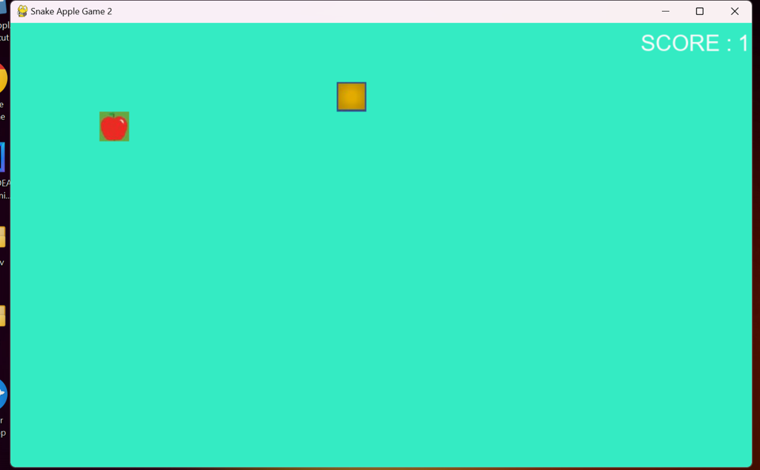
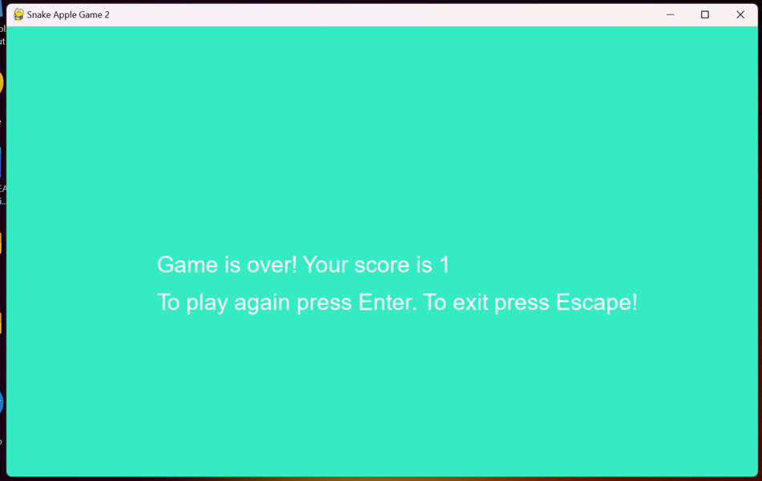

# Snake_Apple_Game

<u><h3>About </h3></u>

This Game has a snake and an apple.
When snake touches the boundary of a screen or itself,the game will over.

Then game over screen shows the score and also ask you,If you want to exit or continue.

<u><h4>GAME DEMO</h4></u>

<u><h4> How to run this game in your system</h4></u>

Step1 :- Download the exe file while viewing raw file.
 Step2 :- Install the exe file in your system.
 Step3 :- Once install, It will create a folder named as Snake_Game.
         This folder will contain resource folder and one exe file.
         This exe file will be your Final Gaming Application.

You can make Shortcut for this application.

